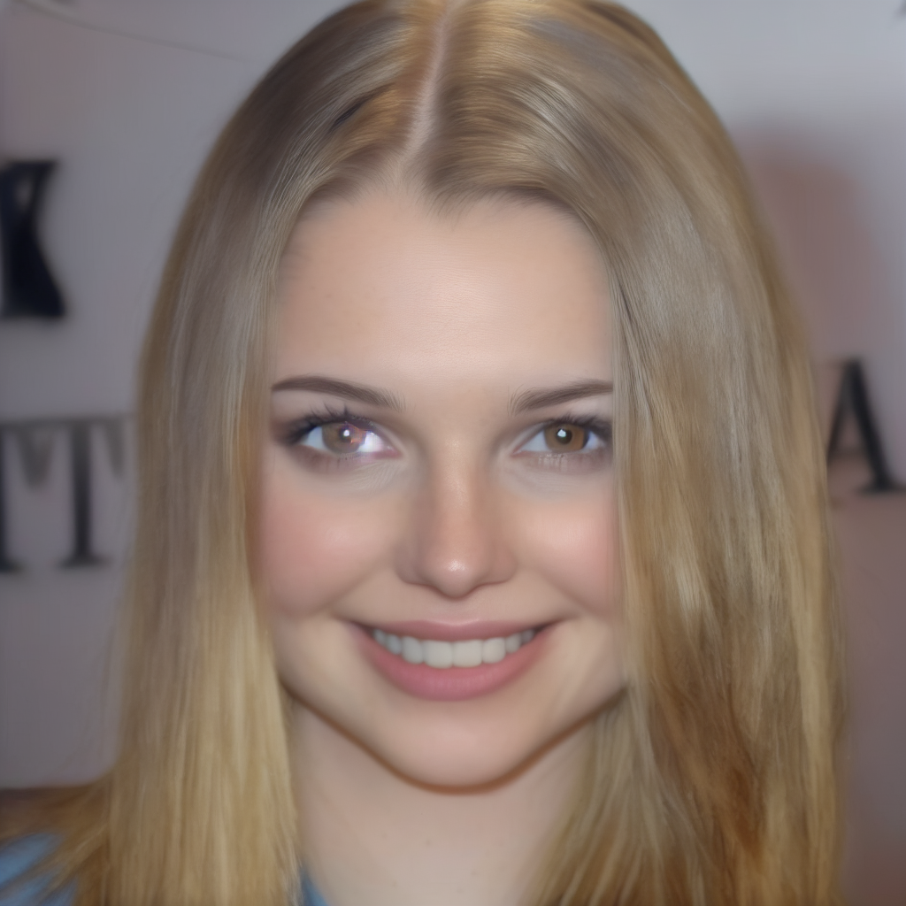
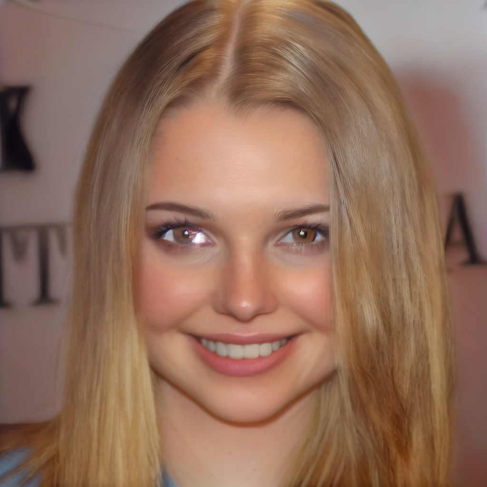
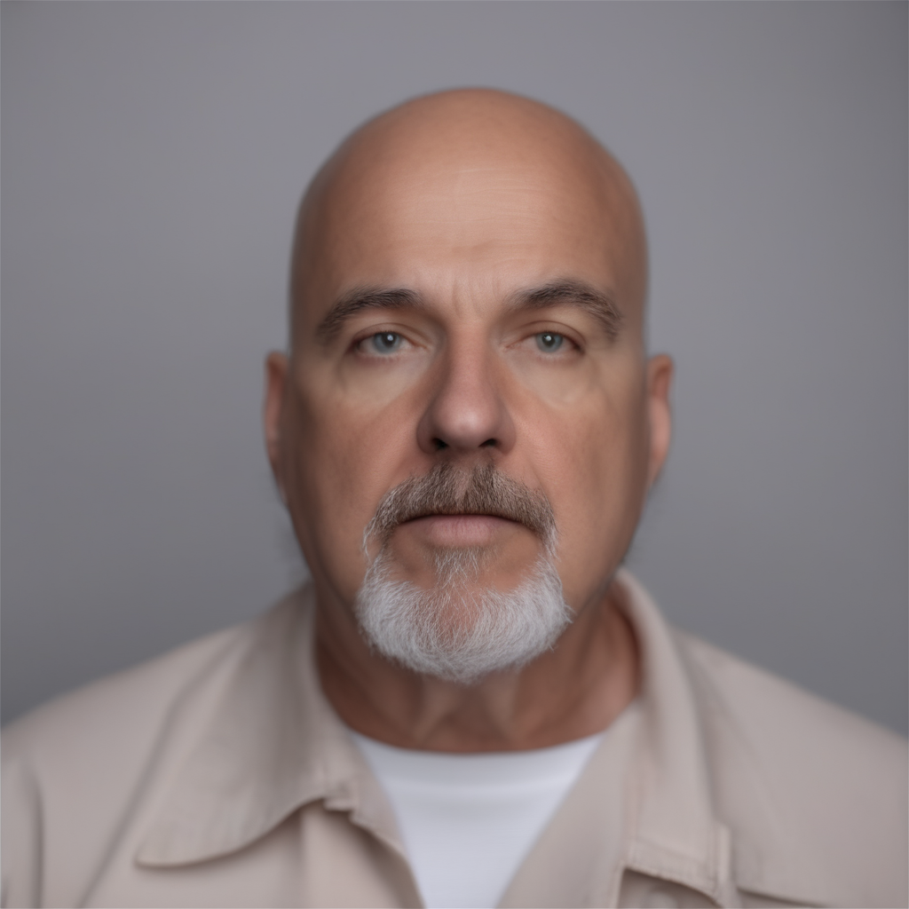
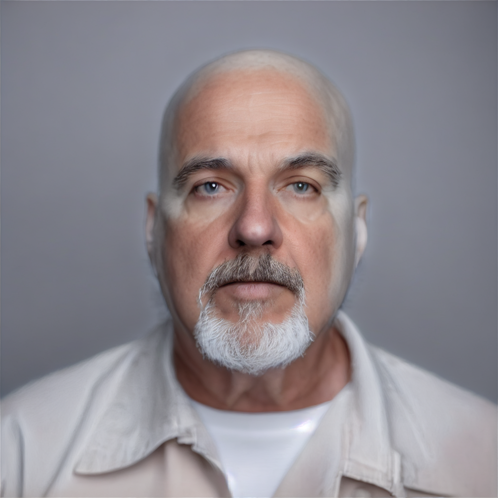
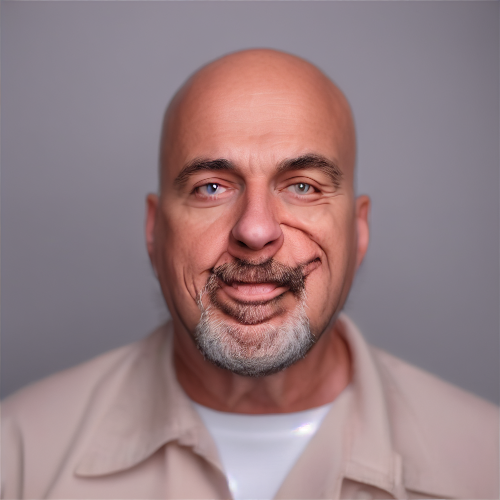
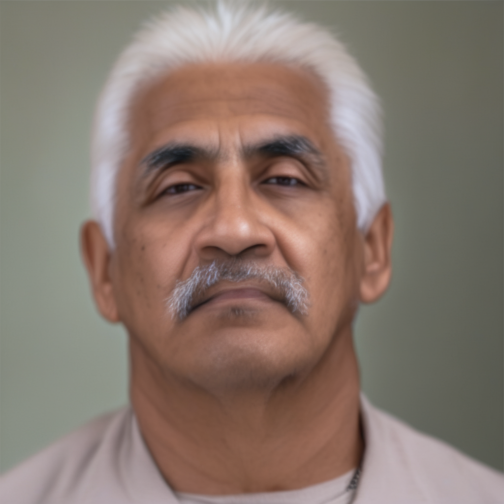
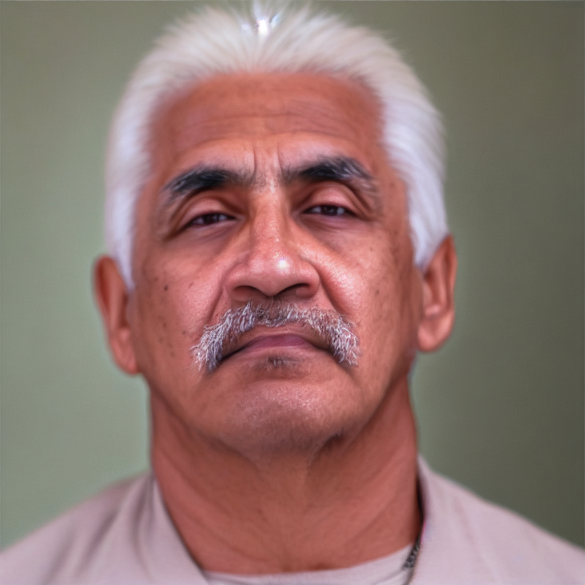
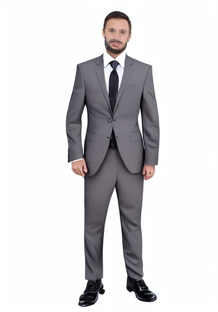

 Here are some additional, mostly failed outputs from the image-to-image model to highlight the inconsistency of the model and that not all outputs are high quality.
 
| Input Image     | Edit Instruction      | Output Image      |
|---------------|---------------|---------------|
|  | make her skin tan (chained with "make her blonde") |   |
|  | give him more hair |   |
|  | make him smile |   |
|  | give him blue eyes |   |
|  | give him acne |   |
|  | put him in a suit |   |